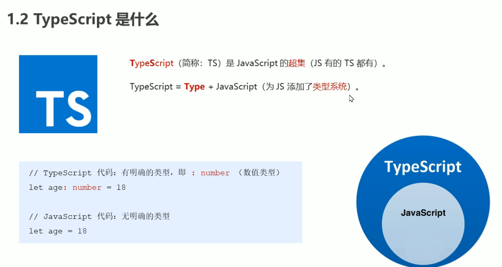
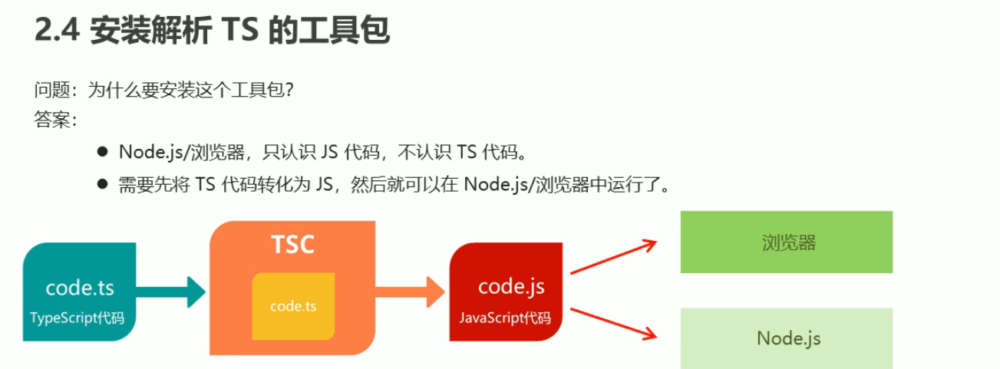

# TS学习笔记

## TypeScript是什么？

官方网站：https://www.typescriptlang.org/

笔记：https://www.dengwb.com/typescript/basics/basis-data-types.html

比js添加了类型功能

## 

## TSC解析工具包



转换工具

https://www.npmjs.com/package/typescript

```shell
$ npm i -g typescript
# ts直接转化js
$ tsc --help
```

合并转换工具

https://www.npmjs.com/package/ts-node

```
$ npm i -g ts-node
```

推荐方法：vscode中内置tasks和launch，配置完毕即可F5执行即可。

### 声明文件

尝试安装**@types/xxx**, **@type/xxx**  声明文件

```
自动安装声明文件
npm i @type/react -D
npm i @types/owl-ui -D
```

手动编写声明文件

#### 声明文件放在哪？

在介绍声明文件如何编写之前，列举一下一般声明文件存放的方式。

1. 目录 `src/@types/`，在 `src` 目录新建 `@types` 目录，在其中编写 `.d.ts` 声明文件，声明文件会自动被识别，可以在此为一些没有声明文件的模块编写自己的声明文件，实际上在 `tsconfig.json` 中 `include` 字段包含的范围内编写 `.d.ts`，都将被自动识别；
2. 与被声明的 `js` 文件同级目录内，创建相同名称的 `.d.ts` 文件，这样也会被自动识别；
3. 设置 `package.json` 中的 `typings` 属性值，如 `./index.d.ts`. 这样系统会识别该地址的声明文件。同样当我们把自己的js库发布到 npm 上时，按照该方法绑定声明文件。
4. 同过 npm 模块安装，如 `@type/react` ，它存放在 `node_modules/@types/` 路径下。

#### 如何发布声明文件？

如果我们自己实现了一个js库，如何来写声明文件呢？目前有两种方式用来发布声明文件到 `npm` 上：

1. 与你的 `npm` 包同时捆绑在一起；
2. 发布到 `npm` 上的 [@types organization](https://www.npmjs.com/~types)

#### 包含声明文件npm包含声明文件

在 `package.json` 中，你的需要指定 `npm` 包的主 `js` 文件，那么你还需要指定主声明文件。如下：

```json
{
  "name": "owl-redux",
  "version": "0.0.1",
  "description": "A simple version of redux",
  "main": "dist/owl-redux.js",
  "typings": "index.d.ts"
}
```

有的 `npm` 包设置的 `types` 属性，它和 `typings` 具有相同意义。

TIP

如果你的 `npm` 包需要依赖于其他包，需要将依赖放在 `dependencies` 中

#### 发布到@types

[@types](https://www.npmjs.com/~types) 下面的包是从 [DefinitelyTyped](https://github.com/DefinitelyTyped/DefinitelyTyped) 里自动发布的，通过 [types-publisher](https://github.com/Microsoft/types-publisher) 工具。 如果想让你的包发布为@types包，提交一个pull request到 https://github.com/DefinitelyTyped/DefinitelyTyped。 在这里查看详细信息 [contribution guidelines page](http://definitelytyped.org/guides/contributing.html)。

## tsconfig.json配置


### 其他配置


### 常见异常解决方法


